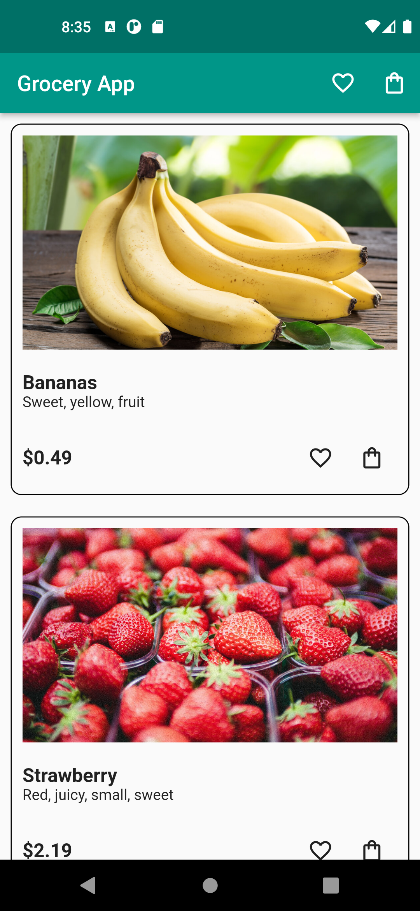
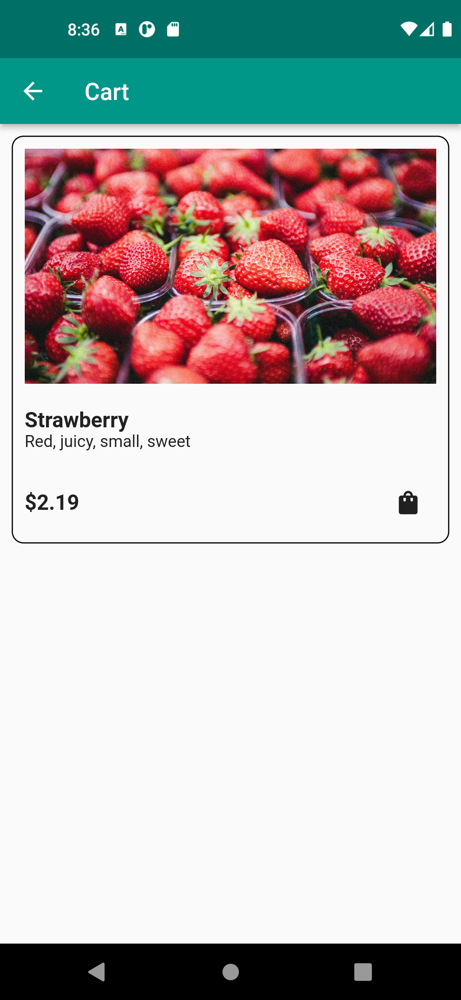
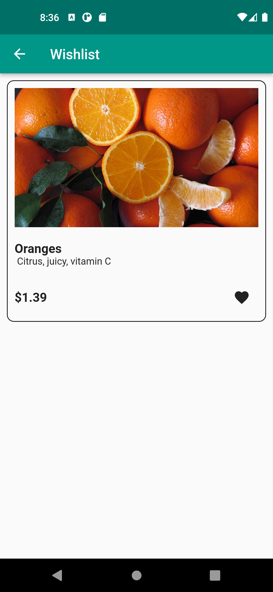

# 🥗 Grocery App

A simple Flutter app to learn and practice the Bloc architecture.

## Packages
* bloc: [link](https://pub.dev/packages/bloc)
* flutter_bloc: [link](https://pub.dev/packages/flutter_bloc)

## Screenshots
</img>
</img>
</img>
